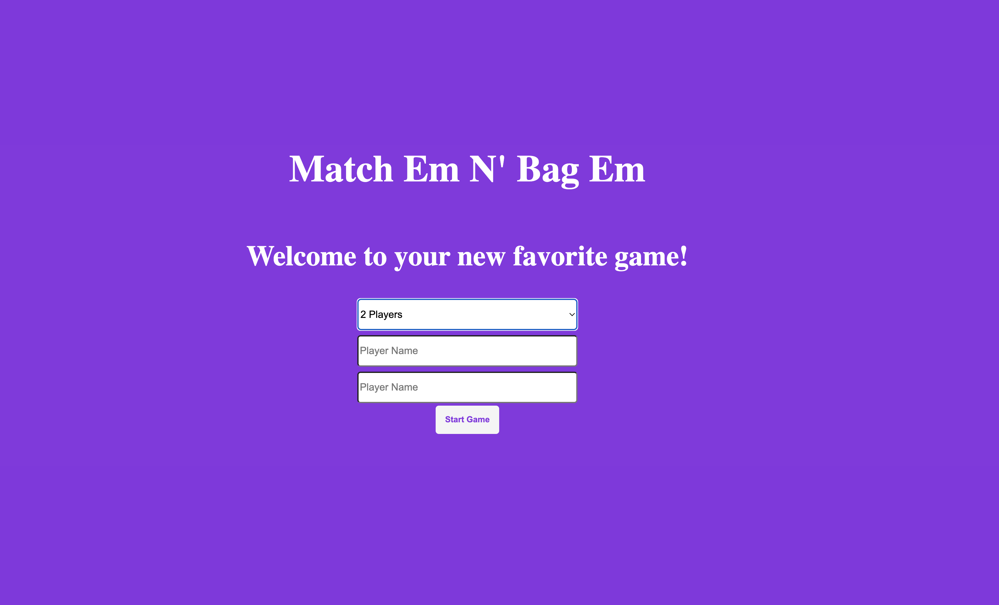

# Match Em N' Bag Em 🎴

A multiplayer memory matching card game featuring Arabic letters. Test your memory skills solo or challenge friends by finding matching pairs of cards!



## 🌐 Live Demo

**[Play the Game Here](https://abdirxhmxn.github.io/matching-card/)** *(Add your hosted URL)*

## 📖 About The Project

Match Em N' Bag Em is an interactive browser-based memory card game built with vanilla JavaScript. Players flip cards to find matching pairs of Arabic alphabet characters, competing for the highest score. The game supports 1-3 players and features a clean, responsive design that works seamlessly across all devices.

### Key Features

✨ **Multiplayer Support** - Play alone or with up to 3 players  
🎯 **Score Tracking** - Real-time scoreboard updates for all players  
🔄 **Smart Turn System** - Automatic turn switching in multiplayer mode  
📱 **Fully Responsive** - Optimized for mobile, tablet, and desktop  
🎨 **Smooth Animations** - Card flips and match effects  
♻️ **Rematch Option** - Quick restart without losing player data  

## 🛠️ Tech Stack

- **HTML5** - Semantic markup and structure
- **CSS3** - Custom styling with Flexbox, animations, and media queries
- **JavaScript (ES6+)** - Classes, DOM manipulation, and game logic
- **URL Parameters** - For passing player data between pages

### JavaScript Concepts Used

- ES6 Classes and Constructor Functions
- Array methods (`forEach`, `every`, `sort`)
- DOM Manipulation (`querySelector`, `addEventListener`)
- Event Handling and Event Delegation
- Asynchronous JavaScript (`setTimeout`)
- URL Search Parameters API
- Local state management

## 🚀 Getting Started

### Prerequisites

- A modern web browser (Chrome, Firefox, Safari, or Edge)
- No build tools or dependencies required!

### Installation

1. **Clone the repository**
   ```bash
   git clone https://github.com/yourusername/match-em-n-bag-em.git
   ```

2. **Navigate to the project directory**
   ```bash
   cd match-em-n-bag-em
   ```

3. **Open in browser**
   - Simply open `index.html` in your browser

## 🎮 How to Play

### Setup
1. Select the number of players (1-3)
2. Enter player name(s)
3. Click "Start Game" and wait for the loading animation

### Gameplay
1. **Click any card** to flip it over and reveal the Arabic letter
2. **Click a second card** to find its matching pair
3. **Match found?** Both cards stay flipped and you earn 2 points
4. **No match?** Cards flip back after 1 second
5. **Multiplayer:** Players take turns until all matches are found
6. **Winner:** Player with the most points when all cards are matched!

### Controls
- **Rematch** - Replay with same players and reset scores
- **Start Over** - Return to player setup screen

## 📂 Project Structure

```
match-em-n-bag-em/
│
├── index.html              # Landing page - player setup
├── game.html               # Game board page
│
├── css/
│   ├── style.css          # Landing page styles
│   └── main.css           # Game board styles
│
└── js/
    ├── main.js            # Landing page logic & navigation
    └── game.js            # Core game mechanics & logic
```

## 💻 Code Overview

### Player Constructor
```javascript
function Player(name) {
    this.name = name;
}
```

### Game Class
The `Game` class handles all core functionality:

```javascript
class Game {
    // Properties
    cells = document.querySelectorAll('.card')
    currentPlayer = player1
    gameOver = false
    arrayLetters = ['ا', 'ا', 'ب', 'ب', ...] // Arabic letters
    
    // Methods
    startGame()      // Initialize game and event listeners
    updateCell(i)    // Handle card clicks
    checkwinner()    // Determine game winner
    switchPlayer()   // Alternate turns in multiplayer
    deleteMatch()    // Remove matched cards
    randomBoard()    // Shuffle cards
    rematchGame()    // Reset for new round
}
```

### Key Features Implemented

**Card Matching Logic**
```javascript
if (this.cardFlipped.length === 2) {
    if (this.cardFlipped[0].innerText === this.cardFlipped[1].innerText) {
        // Match found - update score
        this.currentPlayerScore += 2;
        this.deleteMatch();
    } else {
        // No match - flip back after delay
        setTimeout(() => this.update(), 1000);
    }
}
```

**URL Parameter Navigation**
```javascript
// Passing data between pages
const url = new URL(window.location.href);
player1 = new Player(url.searchParams.get("p1"));
player2 = new Player(url.searchParams.get("p2"));
```

**Winner Determination**
- Handles single winner scenarios
- Detects 2-way and 3-way ties
- Displays appropriate victory message

## 📱 Responsive Design

The game includes breakpoint optimizations for:

- **Desktop** (1200px+)
- **Laptop** (992px - 1199px)
- **Tablet** (768px - 991px)
- **Mobile** (576px - 767px)
- **Small Mobile** (≤420px)

## 🎨 Screenshots

### Landing Page


### Game Board


### Winner Screen


## 🔮 Future Enhancements

- [ ] Timer mode for speed challenges
- [ ] Additional difficulty levels (more card pairs)
- [ ] Sound effects and music toggle
- [ ] LocalStorage for high scores
- [ ] Multiple themes (emojis, numbers, symbols)
- [ ] Keyboard navigation support
- [ ] Animation customization options

## 📝 Lessons Learned

This project strengthened my understanding of:
- **Object-Oriented JavaScript** - Using constructor functions and ES6 classes
- **Game State Management** - Tracking turns, scores, and win conditions
- **Asynchronous Flow** - Using setTimeout for card flip delays
- **DOM Manipulation** - Dynamic updates and event handling
- **Responsive CSS** - Mobile-first design with media queries
- **URL Routing** - Client-side data passing between pages

## 🐛 Known Issues

- None currently! Feel free to report any bugs in the Issues tab.

## 🤝 Contributing

Contributions are welcome! To contribute:

1. Fork the project
2. Create a feature branch (`git checkout -b feature/AmazingFeature`)
3. Commit changes (`git commit -m 'Add AmazingFeature'`)
4. Push to branch (`git push origin feature/AmazingFeature`)
5. Open a Pull Request

## 🙏 Acknowledgments

- Bootcamp curriculum for project foundation
- Cory for pair programming assistance
- Stack Overflow community for algorithm references
- ChatGPT for debugging support

## 📄 License

This project is part of a coding bootcamp curriculum and is available for educational purposes.

## 👤 Author

**Your Name**
- GitHub: [@yourusername](https://github.com/yourusername)
- LinkedIn: [Your Name](https://linkedin.com/in/yourprofile)
- Portfolio: [yourportfolio.com](https://yourportfolio.com)

---

⭐ **If you found this project helpful, please consider giving it a star!**

*Built with vanilla JavaScript as part of my web development journey*
